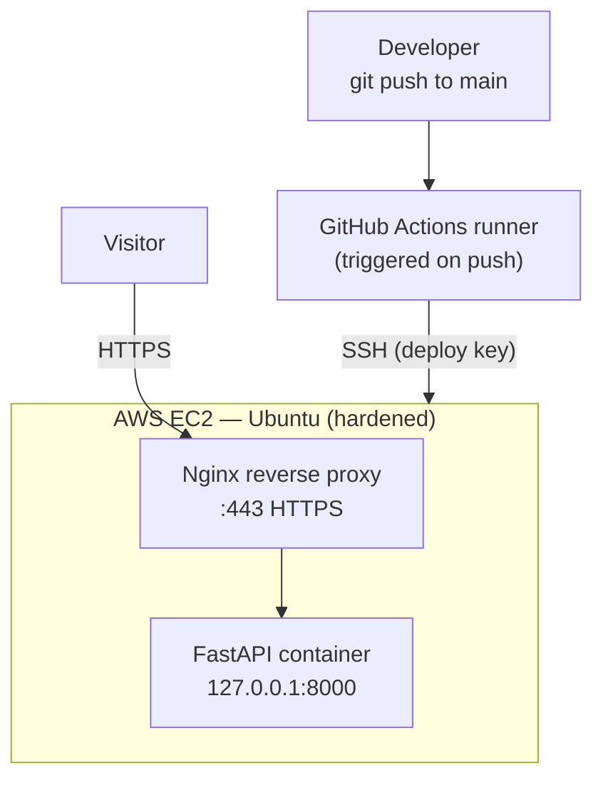

# FastAPI CI/CD Deployment Pipeline

A small FastAPI service, containerized with Docker and deployed to a self-managed
Linux server on AWS — with a full CI/CD pipeline that automatically rebuilds and
redeploys the app on every push to `main`. Served over HTTPS behind an Nginx
reverse proxy.

This project is less about the app itself and more about the **infrastructure and
automation around it**: provisioning a cloud server, securing it to production
standards, containerizing a service, terminating TLS, and wiring up continuous
deployment.

---

## Tech stack

| Layer            | Tooling                                  |
|------------------|------------------------------------------|
| Application      | Python, FastAPI, Uvicorn                 |
| Containerization | Docker                                   |
| Server           | AWS EC2 (Ubuntu LTS)                      |
| Reverse proxy    | Nginx                                     |
| TLS / HTTPS      | Let's Encrypt + Certbot (auto-renewing)  |
| CI/CD            | GitHub Actions                           |
| DNS              | DuckDNS                                   |

---

## Architecture



A request from the internet hits Nginx on port 443, which terminates TLS and
forwards the request internally to the FastAPI container listening on
`127.0.0.1:8000`. The container is never exposed to the public internet directly.

---

## How the CI/CD pipeline works

On every push to `main`, GitHub Actions:

1. Spins up a fresh, ephemeral Ubuntu runner.
2. Opens an SSH connection to the EC2 server using a dedicated deploy key
   (stored as an encrypted GitHub secret).
3. Runs the deploy script on the server: pull the latest code, rebuild the
   Docker image, swap the running container, and prune old images.

Because the image is rebuilt *after* the old container is confirmed running, a
failed build leaves the previous version serving — the broken code never reaches
production.

Workflow definition: [`.github/workflows/deploy.yml`](.github/workflows/deploy.yml)

---

## Server hardening

The server isn't a default box — it's secured the way a production host should be:

- **SSH key-only authentication** (password and root login disabled).
- **Two-layer firewall:** AWS Security Group at the cloud edge + UFW on the host,
  exposing only ports 22, 80, and 443.
- **fail2ban** to auto-ban brute-force login attempts.
- **Automatic security updates** enabled.

---

## API endpoints

| Method | Path       | Description                          |
|--------|------------|--------------------------------------|
| GET    | `/health`  | Health check, returns `{"status":"ok"}` |
| GET    | `/add`     | Adds two integers (`?a=&b=`)         |
| GET    | `/docs`    | Auto-generated Swagger UI            |

---

## Running locally

```bash
git clone https://github.com/hamzafauzi/my-cicd-project.git
cd my-cicd-project
docker build -t myapp .
docker run -d -p 8000:8000 myapp
# visit http://localhost:8000/docs
```

---

## Future improvements

- **Add a test stage (CI):** run the test suite on the runner and block deploys
  if tests fail — turning this into a true CI *and* CD pipeline.
- **Registry-based deploys:** build the image on the runner, push to a container
  registry (GHCR), and have the server pull the finished image — separating build
  from runtime so the server never compiles.
- **Monitoring & backups:** uptime monitoring (e.g. Uptime Kuma) and automated
  backups, plus a documented rollback runbook.
- **Infrastructure as Code:** provision the server with Terraform and configure it
  with Ansible so the whole environment is reproducible from code.

---

## What this project demonstrates

Provisioning and securing a cloud Linux server, containerizing an application,
configuring a reverse proxy with automated TLS, and building an end-to-end
continuous deployment pipeline — the core workflow of modern DevOps.
